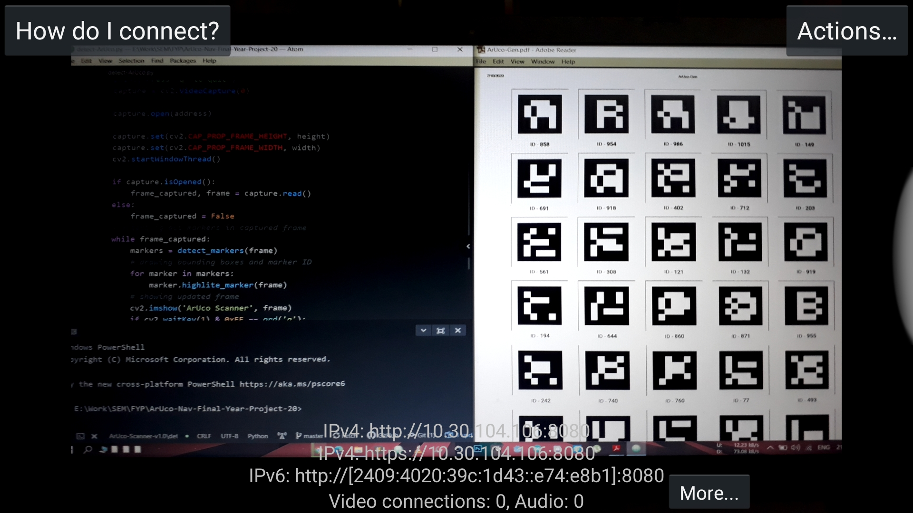
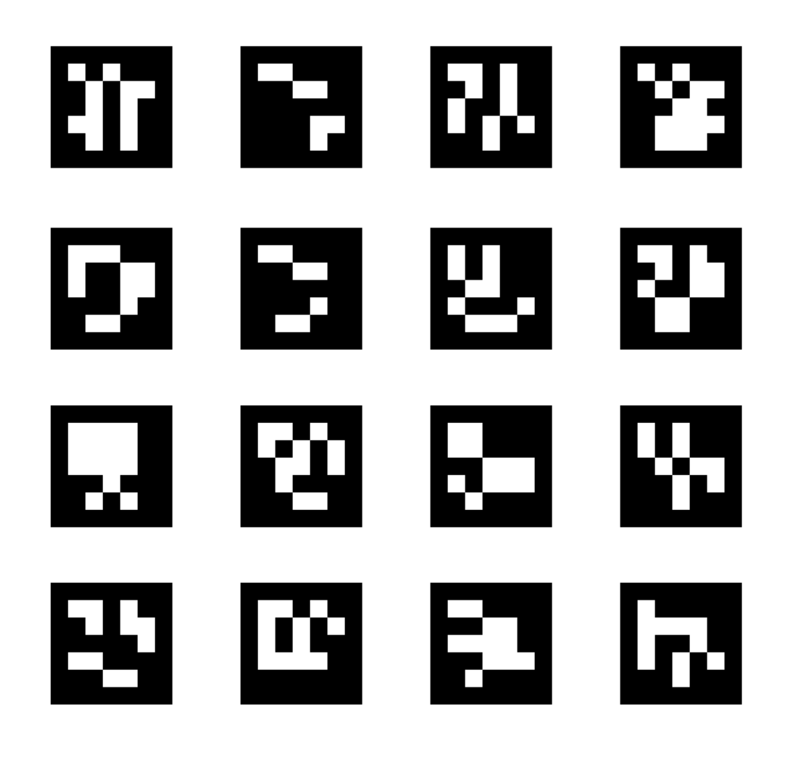
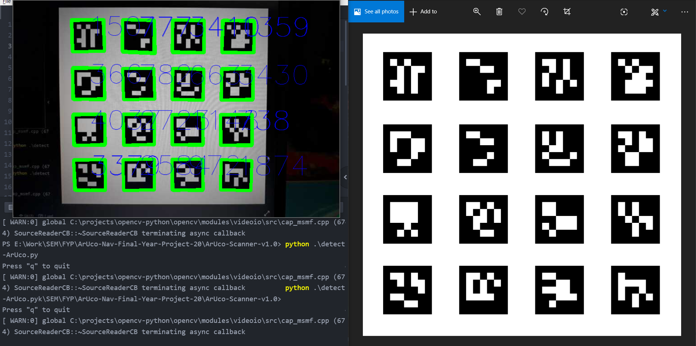

# ArUco-Scanner-v1.0

Detection and tracking of ArUco markers using OpenCV and the IP Webcam app.
---
A simple ArUco marker scanner that tracks fiducial markers using the IP Webcam Android application and the ar_markers 0.5.0 Python package.

<center>IP Webcam app</center>



<center>Generated ArUco markers</center>



<center>Detected ArUco markers</center>



---

### Using ArUco-Gen

From the command line, execute the following:

```bash
# Clone this repository
$ git clone https://github.com/ArUco-Nav-Final-Year-Project-20/ArUco-Scanner-v1.0.git/
```
```bash
# Go into the repository
$ cd ArUco-Scanner-v1.0/
```
```bash
# Install dependencies
$ pip install opencv-python
$ pip install ar-markers
```
```bash
# Generate ArUco markers
# (replace N with the number of markers you wish to generate)
$ ar_markers_generate.py -g N
```

Launch the IP Webcam app and start the vision server.

Replace the value of the ```address``` string in ```detectArUco.py``` with the IPv4 address obtained from the IP Webcam server.

```bash
# Detect ArUco markers
$ python detectArUco.py
```
